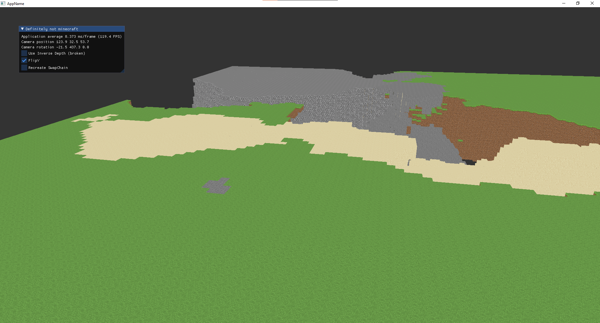

# Definitely not Minecraft

This repository contains my playground for vulkan rendering. I wanted to experiment a bit with generating and rendering voxel worlds (similar to Minecraft). The project is currently in an early WIP stage so don't expect finished code here. 

My interest was mostly in understanding how CMake can be used to get external dependencies. Another point of interest was the compute shader to generate draw calls. 

I have multiple things which I want to implement and the current state is definitely not finished. There are some parts of the code which can be definitely improved but I wanted to have something running first. 

# External code 

The code base was started from a sample from the vulkan-hpp repository. Various smaller things were taken from the vulkan tutorial or sascha willems examples. The texture sheet was created from block textures in the faithful texture pack. 
https://github.com/KhronosGroup/Vulkan-Hpp
https://github.com/Overv/VulkanTutorial
https://github.com/Faithful-Resource-Pack/Faithful-Java-64x

# Screenshots 

